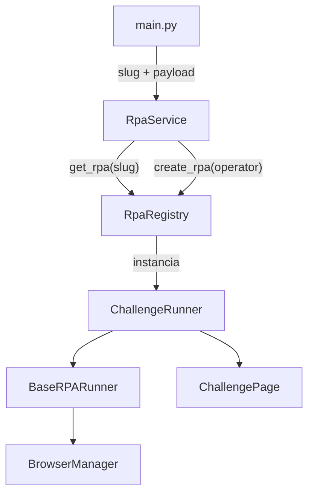

# RPA Challenge Automation

Automação do [RPA Challenge](https://rpachallenge.com/) em Python com Playwright. Lê registros de uma planilha Excel, preenche o formulário round a round e gera screenshot do resultado.

O projeto foi estruturado como **plataforma de execução de RPAs**, não só um script único: hoje roda o *RPA Challenge*, mas a arquitetura permite registrar e executar **vários robôs** (outros portais, filas, APIs) sem reescrever o fluxo de browser, logging ou entrada da aplicação.

## Visão do projeto

A ideia é separar três responsabilidades:

| Camada | Papel |
|--------|-------|
| **Entrada da aplicação** | Recebe *qual* RPA rodar e *com quais dados* (`main`, API, fila) |
| **Orquestração** | `RpaService` valida o payload e despacha para o runner correto |
| **Automação** | Cada runner (`ChallengeRunner`, futuros…) implementa o caso de uso no browser |

Assim, quando o projeto crescer, você adiciona pastas em `app/rpa/<nome>/` (input, pages, runner) e **uma linha no registry** — o restante do pipeline permanece igual.

## Arquitetura



### Fluxo de execução (hoje)

```
main.py
  └── RpaService.run("rpa-challenge", payload)
        ├── registry.get_rpa(slug)     → operador + classe do Input
        ├── Input.model_validate(...)  → body tipado (ex.: ChallengeInput)
        └── registry.create_rpa(op)    → ChallengeRunner(settings)
              └── BaseRPARunner.run(body)
                    ├── abre/fecha browser (BrowserManager)
                    └── ChallengeRunner.execute(driver, body)
                          └── ChallengePage (seletores + ações)
```

### Componentes

#### `RpaService` — porta de entrada

- Único ponto que a aplicação usa para **disparar** um RPA.
- Não conhece Playwright nem seletores; só: slug, payload em `dict`, resposta `RPAResponse`.
- Ideal para evoluir para REST, CLI, worker de fila ou scheduler — todos chamam o mesmo `RpaService.run`.

#### `RpaRegistry` — catálogo de robôs (factory)

- Mapeia **slug** → `(RPAOperator, Input)` e **operador** → **classe do Runner**.
- `create_rpa(operator)` funciona como **factory**: devolve a instância do runner com `settings`.
- **Hoje está hardcoded** em dicionários no código (`_by_slug`, `_runners`).
- **Amanhã** pode carregar de banco, arquivo YAML, API ou fila de jobs sem mudar o `RpaService`:

```python
# Exemplo futuro (conceitual)
# registry.load_from_database()
# registry.register_from_queue(message)
```

#### `BaseRPARunner` — contrato e ciclo de vida

- Template comum a **todos** os RPAs: abrir browser, chamar `execute`, logar início/fim, fechar browser.
- Cada automação herda e implementa só `execute(driver, body)` (+ `operator`).
- Garante que browser, timeout e tratamento de erro sejam consistentes entre robôs.

#### `ChallengeRunner` + `ChallengePage` — automação específica

- **Runner**: orquestra rounds (Excel → preencher → submit → próximo round).
- **Pages**: seletores e interações com o site (Page Object).
- **Input**: dados de entrada validados (registros do Excel).

Outro portal seguiria o mesmo trio: `OutroInput`, `OutroPage`, `OutroRunner`.

## Escalabilidade — adicionar um novo RPA

1. Criar `app/rpa/<portal>/` com `input.py`, `pages.py`, `runner.py`.
2. Definir `RPAOperator` em `app/domain/enums.py`.
3. Registrar em `app/rpa/registry.py`:

```python
_by_slug["meu-portal"] = (RPAOperator.MEU_PORTAL, MeuPortalInput)
_runners[RPAOperator.MEU_PORTAL] = MeuPortalRunner
```

4. Executar: `await RpaService.run("meu-portal", payload)`.

Nenhuma alteração obrigatória em `main.py`, `BaseRPARunner` ou `RpaService`.

## Evolução futura (alto volume / muitos robôs)

| Hoje | Possível evolução |
|------|-------------------|
| Registry em dict no código | Registry dinâmico (DB, config remota, plugin discovery) |
| `main.py` dispara um job | Fila (Redis, SQS, RabbitMQ) + workers N paralelos |
| Um browser por `run()` | Pool de browsers ou fila por operador |
| Payload montado no cliente | API POST `/rpa/{slug}/run` com JSON validado pelo `Input` |

A estrutura atual já separa **quem chama** (`RpaService`), **quem resolve o robô** (`Registry`) e **quem executa no site** (`Runner` + `Pages`), que é o mínimo necessário para escalar em massa sem acoplar automações entre si.

## Requisitos

- Python 3.11+
- Navegador Chromium (via Playwright)

## Instalação

```bash
python -m venv .venv
source .venv/bin/activate   # Windows: .venv\Scripts\activate
pip install -r requirements.txt
playwright install chromium
```

> No Ubuntu 26, se `playwright install` falhar, use um Chromium já instalado ou defina `PLAYWRIGHT_CHROMIUM_EXECUTABLE_PATH` no `.env`.

## Configuração

Copie o exemplo e ajuste se necessário:

```bash
cp .env.example .env
```

| Variável | Descrição | Padrão |
|----------|-----------|--------|
| `EXCEL_FILE_PATH` | Planilha com os dados | `data/challenge.xlsx` |
| `CHALLENGE_URL` | URL do challenge | `https://rpachallenge.com/` |
| `HEADLESS` | Browser sem interface | `False` |
| `TIMEOUT` | Timeout Playwright (ms) | `15000` |

A planilha deve ter as colunas: `First Name`, `Last Name`, `Company Name`, `Role in Company`, `Address`, `Email`, `Phone Number`.

## Execução

```bash
python main.py
```

Fluxo:

1. Lê o Excel e monta o payload (`ChallengeInput`)
2. `RpaService` resolve o RPA no registry (`rpa-challenge`)
3. `ChallengeRunner` abre o site, clica em Start e processa cada linha como um round
4. Salva screenshot em `output/score.png`

## Estrutura do projeto

```
app/
├── browser/              # Playwright + BrowserManager (sessão do navegador)
├── core/                 # config, logger, exceptions, types
├── domain/               # models (ChallengeRecord, RPAResponse) e enums
├── rpa/
│   ├── base.py           # BaseRPARunner — ciclo de vida comum
│   ├── registry.py       # RpaRegistry — slug → input + factory do runner
│   └── challenge/        # automação do RPA Challenge
│       ├── input.py      # ChallengeInput (payload / records do Excel)
│       ├── pages.py      # seletores + ChallengePage
│       └── runner.py     # ChallengeRunner (rounds)
└── services/
    ├── excel_service.py  # leitura da planilha
    └── rpa_service.py    # despacho: slug + payload → runner
data/                     # planilha Excel
logs/                     # logs da execução
output/                   # screenshot final
main.py                   # ponto de entrada CLI
```

## Logs

Os logs ficam em **`logs/app.log`** (criado automaticamente ao rodar `main.py`).

Também são exibidos no console. Formato:

```
2026-05-29 14:00:00 | INFO     | app.rpa.base | rpa.start operator=rpa_challenge
```

## Saída

| Artefato | Caminho |
|----------|---------|
| Log | `logs/app.log` |
| Screenshot | `output/score.png` |

## Uso programático

```python
from app.rpa.challenge.input import ChallengeInput
from app.services.rpa_service import RpaService

result = await RpaService.run("rpa-challenge", ChallengeInput.build_payload())
print(result.success, result.message)
```
